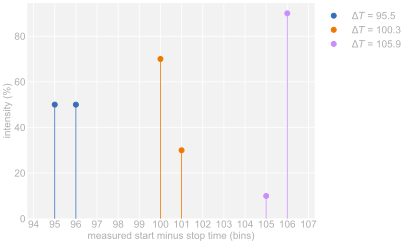
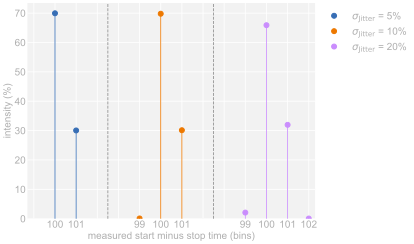
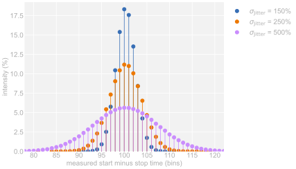
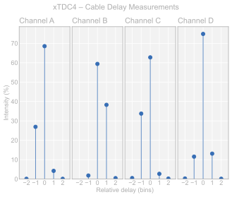
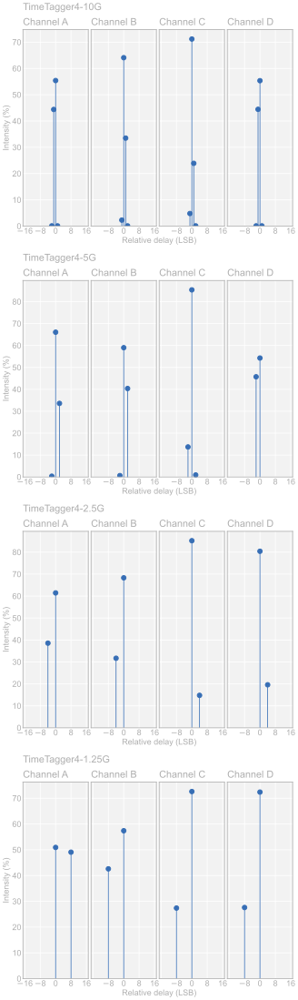

==========================================
Application Note – Quantization vs. Jitter
==========================================

.. admonition:: In this App-Note

    In this application note, we will highlight the effects of quantization errors
    and jitter on classic start-stop time-to-digital converters.
    

Performance Test - Measuring a constant delay
=============================================

Measuring a constant delay is a good way to test the performance of a classic
start-stop time-to-digital converter (TDC), such as the
`xHPTDC8 <https://www.cronologic.de/product/xhptdc8-pcie>`__,
`xTDC4 <https://www.cronologic.de/product/xtdc4>`__,
and `TimeTagger4 <https://www.cronologic.de/product/timetagger>`__
devices sold by `cronologic <https://www.cronologic.de>`__.

One way to measure constant delays is to repeatedly measure the delay caused by
a long cable:
A signal is split into two.
Then, the timing of the first signal is measured by the *start* channel of the TDC.
The second signal is delayed by sending it through a long cable,
then its timing is measured by the *stop* channel.
This measurement is repeated many times and a histogram is filled with the measured
difference of the *stop time* minus the *start time*.

The shape of the output histogram will depend on two factors:
the bin size and the accuracy of measuring the exact start and stop times.
In particular, the ratio between bin size and accuracy will be of interest in this
application note.

The distinction between the two factors is critical, as we will show in this
application note. The bin size causes a *quantization error*. Other error sources
that keep us from accurately measuring real times are referred to as *jitter*.
Jitter can be caused by many things, for example, it may be the caused by the jitter
of an external reference clock, the different
triggering times of the start/stop channels due to noisy signals, or unequally and
unknown sized TDC bins.
All these errors are combined and are simply referred to as “jitter” throughout
this application note.

.. note::
    In this application note, everything will be given in units of the bin size,
    that is, the bin size is 1.

.. _case1:

Case 1 - Perfect TDC
====================

For reference, let's assume we have a perfect TDC that has absolute accuracy, that is,
absolutely no jitter is present.
Such a TDC quantizes continuous times perfectly into discrete bins
(here, of bin size 1).

Let's consider an example, where we want to measure a constant delay of,
let's say, *ΔT* = 100.3.
Using asynchronous (to the TDC's reference clock) start times *t*\ :sub:`start` means
that the start times are effectively random.
The stop times are fixed at *t*\ :sub:`stop` = *t*\ :sub:`start` + *ΔT*.

In our example of *ΔT* = 100.3, we will get two possible measurements:
100 and 101. To understand this, consider the following two start times

**Example 1:** *t*\ :sub:`start` = 0.1 and *t*\ :sub:`stop` = 0.1 + 100.3 = 100.4
    Due to the quantization of times into bins of size 1, the TDC will measure
    *t*\ :sub:`start,TDC` = 0, *t*\ :sub:`stop,TDC` = 100,
    and *ΔT*\ :sub:`TDC` = 100 – 0 = **100**.

**Example 2**: *t*\ :sub:`0` = 0.9 and *t*\ :sub:`1` = 0.9 + 100.3 = 101.2
    Now
    *t*\ :sub:`start,TDC` = 0, *t*\ :sub:`stop,TDC` = 101,
    and *ΔT*\ :sub:`TDC` = 101 – 0 = **101**.
    
Note that in the two examples above, there are *no error sources besides the
quantization error*.
A perfect TDC will always measure two discrete values for a constant delay (unless
the delay is an *exact* multiple of the bin size) and the relative intensity of these
values depends on the actual delay.

The following graphic shows the final histogram after simulating
one million measurements of various *ΔT* with a perfect TDC.
As one can see, the relative intensity of the bins changes, but there are always two
bins in the histogram.

Note that from the above histogram, one cannot estimate the error that results from
general jitter, as the histogram is purely the result of the quantization.
For example, the standard deviation of the blue data (with *ΔT* = 95.5) is 0.5,
however, timing errors due to general jitter are *zero*
(as per definition of the simulation).

.. _case2:

Case 2 - TDC dominated by quantization error
============================================

Let's now consider a TDC that is dominated by the quantization error.
Our simulation is identical to :ref:`Case 1 <case1>`
except that now, before the real times are quantized, a small
(compared to the bin size) jitter is added to them.

In particular, the jitter follows a normal distribution with a standard deviation
of 5, 10, and 20% of the bin size.

The resulting histograms are shown in the following graphic.

One can see that at 5%,
the histogram is virtually identical to the ideal case shown above. With increasing
jitter, more output values appear, however, qualitatively, the histograms still
resemble the ideal case.

Case 3 - TDC dominated by jitter
================================

Increasing the jitter ultimately yields histograms that are dominated by it.

In the following figure, measurement of a constant delay of 100.3 is simulated
multiple times with the same method as in :ref:`Case 2 <case2>`, but
with jitter magnitudes comparable or much larger than the binsize.

Note that, as these histograms are dominated by the jitter and *not* the quantization
error, one can estimate the magnitude of the jitter from the histograms. For example,
the standard deviation of the purple histogram data
(with :math:`\sigma_{\mathrm{Jitter}}` = 500%) is :math:`\sigma_{\mathrm{Hist}}` = 708%,
close to the expectation of :math:`\sqrt{2} \times \sigma_{\mathrm{Jitter}}` 
(since the TDC performs two measurements, start and stop, the jitter
applies twice, ergo the expected standard deviation of the histogram data is a
factor :math:`\sqrt{2}` larger than the standard deviation of the jitter).

Choosing a data bin size
========================

.. note::

    In the following, two different bin sizes are discussed.

    The *intrinsic bin size* refers to the quantization the TDC chip performs, that is,
    what delta time corresponds to which code number.

    The *data bin size* refers to the code numbers that are output to the user.

When designing a TDC, a manufacturer needs to choose a step size of the output data,
that is, what output codes of the device correspond to what delta times.
This is often referred to as LSB (for Least Significant Bit).
It tells us what delta time corresponds to the smallest change in the TDC output code.
For example, for cronologic's `xTDC4 <https://www.cronologic.de/product/xtdc4>`__,
1 LSB equals 13 ps.

Note that the choice of the data bin size is, in principle, arbitrary.

For instance, the natural choice of a data bin size for a perfect TDC
is the intrinsic bin size of the TDC chip.
Since the bins of a perfect TDC are all equally sized, without error,
choosing a smaller LSB “wastes” output codes, that is, one needs larger numbers
to represent delta times but without gaining any more information.
Equally, choosing a larger LSB discards information.

The choice is less obvious for a real TDC with an intrinsic bin size masked
by errors.
These errors encompass jitter due to noisy signals, or jittering reference
clocks, as well as the fact, that building a TDC with *constant* intrinsic bin sizes is
virtually impossible.
Do you choose a small data bin size that keeps the variation of measured delta times?
Or, do you choose a data bin size corresponding to the average intrinsic bin size,
or even larger?

The appropriate choice depends on something that, so far, was only passingly discussed.

Differential and integral nonlinearity
--------------------------------------

While non-constant intrinsic TDC bin sizes were mentioned, so far, they were generally
mixed in with “general jitter errors.”
If the bin size is unknown, this is valid.
However, the intrinsic bin sizes of a TDC can be measured and calibrated, that is,
one can create a look-up table assigning each TDC bin to its own
corresponding delta time.

Every real TDC has differential and integral nonlinearities (DNL and INL).
The DNL quantifies the size variation of consecutive bins. The INL corresponds to
the mismatch of measured delta times assuming a constant bin size to real delta times.

One can measure the DNL and INL of a real TDC (for example, with a code density test),
an calibrate it.

Ergo, the errors resulting from the TDC's DNL/INL can be corrected for,
which makes these errors different from other timing jitter.
However, calibration is not always possible, feasible, or practical, and never perfect.
Thus, disregarding price point, a TDC with smaller DNL/INL is generally preferable
to a TDC with larger DNL.

Implementing TDC chips such that they have a small DNL is expensive (monetary and/or
in power consumption), which is why compromises have to be struck.

Nevertheless, returning to the question at hand: What data bin size is appropriate
for my real TDC?

If you have a TDC with large DNLs but that is well calibrated, the intrinsic
bin size of the TDC varies, but is known. Choosing a data bin size corresponding to
the average intrinsic bin size now discards information. Some delta times are measured
by your TDC with more precision, warranting a smaller data bin size, even though other
delta times are measured with less precision.

Note, on average, the quantization error of a perfectly calibrated TDC with large DNL
and smaller bin size is the same as the quantization error of a TDC with no DNL but
larger bin size. Even if in the former case, the output data looks smoother
(as the bin size is smaller), the underlying quantization error is the same.

The following animation highlights the difference of two such TDCs, comparing
one with perfect DNLs and a large bin size to another with large DNLs and a small
bin size.

Animation of the measurement principle
======================================

On the left, the constant delay *ΔT* is represented by a blue ruler with fixed length.
The start (and stop) times increase continuously and are quantized by the TDC.
The resulting *measured* *ΔT* is shown by the orange double-arrow above the ruler.

On the right, a histogram of continuously measured delay times is shown.

The top row of the animation represents a perfect TDC with perfect DNL.
Each time gets sorted correctly into perfectly sized bins.

The bottom row represents a TDC with significant DNL but smaller data bin size.

.. video:: _figures/fixed_vs_variable_binsize_100dpi_with_average.mp4
    :align: center
    :autoplay:
    :loop:
    :playsinline:
    :poster: _figures/animation_first_frame.png
    :alt: Animation showing the difference between large and small DNL TDCs

Note that in this representation, the binsize is absolutely known, that is, no jitter
is present. One could, as was done at the beginning of this application note, interpret
the lower row of the animation as a TDC with significant jitter, which means that,
effectively, the binsize is unknown.

TDCs from cronologic
====================

cronologic's
`xHPTDC8 <https://www.cronologic.de/product/xhptdc8-pcie>`__ and 
`xTDC4 <https://www.cronologic.de/product/xtdc4>`__
are implemented using highly specialized integrated circuits, ensuring a small DNL.
Additionally, we take special care designing our boards choosing components with
low intrinsic jitter.
In return, our TDCs do not introduce significant error other than the quantization
error. This becomes apparent in the following histograms of a constant-delay test.

As one can see, the general shape of the histograms closely resembles those shown 
in :ref:`Case 2<case2>`: Our TDCs are dominated by quantization errors, not by other
jitter.

The errors present in TimeTagger series are almost exclusively quantization errors,
as becomes apparent in the following histograms.

